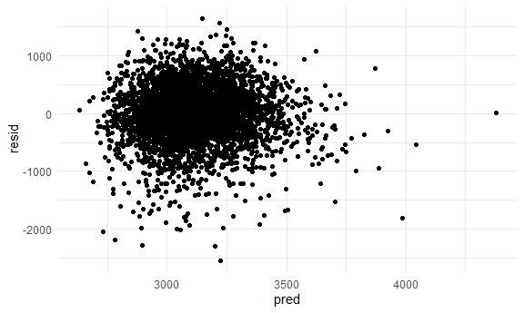
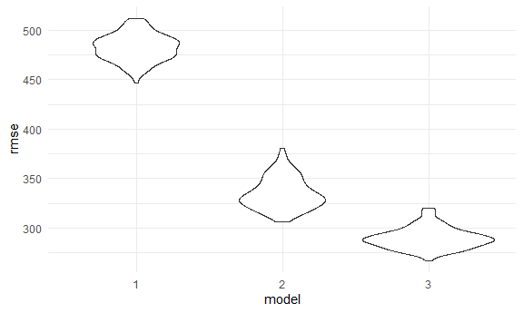
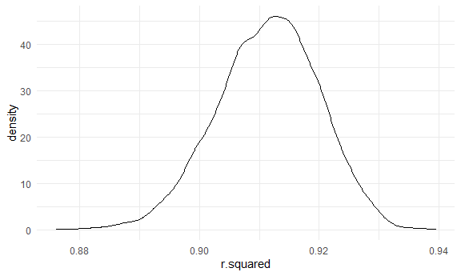
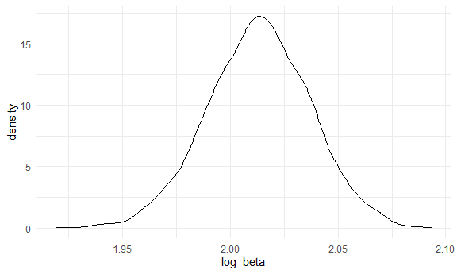

Homework 6
================

### Problem 1

``` r
homicide_df =
  read_csv("data/homicide-data.csv", na = c("", "NA", "Unknown")) %>%
  mutate(
    city_state = str_c(city, state, sep = ", "),
    victim_age = as.numeric(victim_age),
    resolution = case_when(
      disposition == "Closed without arrest" ~ 0,
      disposition == "Open/No arrest"        ~ 0,
      disposition == "Closed by arrest"      ~ 1
    )
  ) %>%
  filter(!city_state %in% c("Dallas, TX", "Phoenix, AZ", "Kansas City, MO", "Tulsa, AL"),
         victim_race %in% c("White", "Black")) %>%
  select(city_state, resolution, victim_age, victim_race, victim_sex)
```

    ## Parsed with column specification:
    ## cols(
    ##   uid = col_character(),
    ##   reported_date = col_double(),
    ##   victim_last = col_character(),
    ##   victim_first = col_character(),
    ##   victim_race = col_character(),
    ##   victim_age = col_double(),
    ##   victim_sex = col_character(),
    ##   city = col_character(),
    ##   state = col_character(),
    ##   lat = col_double(),
    ##   lon = col_double(),
    ##   disposition = col_character()
    ## )

Start with one city.

``` r
baltimore_df =
  homicide_df %>%
  filter(city_state == "Baltimore, MD")

glm(resolution ~ victim_age + victim_race + victim_sex,
    data = baltimore_df,
    family = binomial()) %>%
  broom::tidy() %>%
  mutate(
    OR = exp(estimate),
    CI_lower = exp(estimate - 1.96 * std.error),
    CI_upper = exp(estimate + 1.96 * std.error)
  ) %>%
  select(term, OR, starts_with("CI")) %>%
  knitr::kable(digits = 3)
```

| term              |    OR | CI\_lower | CI\_upper |
| :---------------- | ----: | --------: | --------: |
| (Intercept)       | 1.363 |     0.975 |     1.907 |
| victim\_age       | 0.993 |     0.987 |     1.000 |
| victim\_raceWhite | 2.320 |     1.648 |     3.268 |
| victim\_sexMale   | 0.426 |     0.325 |     0.558 |

Try this across cities.

``` r
models_results_df = 
  homicide_df %>%
  nest(data = -city_state) %>%
  mutate(
    models = 
      map(.x = data, ~glm(resolution ~ victim_age + victim_race + victim_sex, data = .x, family = binomial())),
    results = map(models, broom::tidy)
  ) %>%
  select(city_state, results) %>%
  unnest(results) %>%
  mutate(
    OR = exp(estimate),
    CI_lower = exp(estimate - 1.96 * std.error),
    CI_upper = exp(estimate + 1.96 * std.error)
  ) %>%
  select(city_state, term, OR, starts_with("CI"))
```

``` r
models_results_df %>%
  filter(term == "victim_sexMale") %>%
  mutate(city_state = fct_reorder(city_state, OR)) %>%
  ggplot(aes(x = city_state, y = OR)) +
  geom_point() +
  geom_errorbar(aes(ymin = CI_lower, ymax = CI_upper)) +
  theme(axis.text.x = element_text(angle = 90, hjust = 1))
```


### Problem 2

``` r
baby_df = 
  read_csv("data/birthweight.csv") %>%
  drop_na() %>%
  janitor::clean_names() %>%
  mutate(babysex = as.factor(babysex),
         frace = as.factor(frace),
         malform = as.factor(malform),
         mrace = as.factor(mrace))
```

    ## Parsed with column specification:
    ## cols(
    ##   .default = col_double()
    ## )

    ## See spec(...) for full column specifications.

Fit my own model:

First, based on common sense and biological and physiological knowledge,
I hypothesize that baby’s birth weight can be affected by baby’s sex,
mother’s weight at delivery, family monthly income, presence of
malformations that could affect weight, and previous number of low birth
weight babies. Second, I will build a raw linear model and check the
coefficients.

``` r
model_fit = lm(bwt ~ babysex + delwt + fincome + malform + pnumlbw, data = baby_df) %>%
  broom::tidy()
```

Based on the significance of the 5 coefficients, I will exclude malform
and pnumlbw from my model. Now I rerun the model:

``` r
model1_fit = lm(bwt ~ babysex + delwt + fincome, data = baby_df)
```

The coefficients all look good. Now build a plot of model residuals
against fitted values.

``` r
baby_df %>%
  modelr::add_residuals(model1_fit) %>%
  modelr::add_predictions(model1_fit) %>%
  ggplot(aes(x = pred, y = resid)) +
  geom_point()
```



Build the second and the third model.

``` r
model2_fit = lm(bwt ~ blength + gaweeks, data = baby_df)
model3_fit = lm(bwt ~ bhead + blength + babysex + bhead * blength + bhead * babysex + blength * babysex + bhead * blength * babysex, data = baby_df)
```

Compare the 3 models.

``` r
cv_df = 
  crossv_mc(baby_df, 100) %>%
  mutate(
    train = map(train, as_tibble),
    test = map(test, as_tibble))

# use mutate + map & map2 to fit models to training data and obtain corresponding RMSEs for the testing data
cv_df = 
  cv_df %>% 
  mutate(
    model1_fit  = map(train, ~lm(bwt ~ babysex + delwt + fincome, data = .x)),
    model2_fit  = map(train, ~lm(bwt ~ blength + gaweeks, data = .x)),
    model3_fit  = map(train, ~lm(bwt ~ bhead + blength + babysex + bhead * blength + bhead * babysex + blength * babysex + bhead * blength * babysex, data = as_tibble(.x)))) %>% 
  mutate(
    rmse_1 = map2_dbl(model1_fit, test, ~rmse(model = .x, data = .y)),
    rmse_2 = map2_dbl(model2_fit, test, ~rmse(model = .x, data = .y)),
    rmse_3 = map2_dbl(model3_fit, test, ~rmse(model = .x, data = .y)))

# plot the prediction error distribution for each candidate model
cv_df %>% 
  select(starts_with("rmse")) %>% 
  pivot_longer(
    everything(),
    names_to = "model", 
    values_to = "rmse",
    names_prefix = "rmse_") %>% 
  mutate(model = fct_inorder(model)) %>% 
  ggplot(aes(x = model, y = rmse)) + geom_violin()
```



According to the prediction error distribution for each of the three
candidate model, we can notice that the RMSE clearly decreases in model
3, representing that the predictive accuracy increases in model 3. Among
all of the 3 models, we can predict that the one using head
circumference, length, sex, and all interactions between these is the
most optimal.

### Problem 3

Read in the dataset.

``` r
weather_df = 
  rnoaa::meteo_pull_monitors(
    c("USW00094728"),
    var = c("PRCP", "TMIN", "TMAX"), 
    date_min = "2017-01-01",
    date_max = "2017-12-31") %>%
  mutate(
    name = recode(id, USW00094728 = "CentralPark_NY"),
    tmin = tmin / 10,
    tmax = tmax / 10) %>%
  select(name, id, everything())
```

    ## Registered S3 method overwritten by 'hoardr':
    ##   method           from
    ##   print.cache_info httr

    ## using cached file: C:\Users\xinxu\AppData\Local\Cache/R/noaa_ghcnd/USW00094728.dly

    ## date created (size, mb): 2020-10-10 09:46:33 (7.54)

    ## file min/max dates: 1869-01-01 / 2020-10-31

Generate bootstrap samples.

``` r
bootstrap_df = 
  weather_df %>% 
  modelr::bootstrap(n = 5000) %>% 
  mutate(
    models = map(strap, ~lm(tmax ~ tmin, data = .x) ),
    r_results = map(models, broom::glance),
    coe_results = map(models, broom::tidy)) %>% 
  select(-strap, -models)
```

Build the r\_squared plot and CI.

``` r
r_square =
  bootstrap_df %>%
  unnest(r_results) %>%
  select(- coe_results)

r_square %>%
  ggplot(aes(x = r.squared)) + 
  geom_density()
```



``` r
r_square %>% 
  summarize(
    ci_lower = quantile(r.squared, 0.025), 
    ci_upper = quantile(r.squared, 0.975)) %>%
  knitr::kable(digits = 3)
```

| ci\_lower | ci\_upper |
| --------: | --------: |
|     0.894 |     0.927 |

The distribution of r-square is left-skewed, indicating that outliers
may be included in the bootstrap samples. The 95% CI of r-squared is
(0.894, 0.927).

Build the log(beta0 \* beta1) estimate plot and CI.

``` r
log_estimate = 
  bootstrap_df %>%
  unnest(coe_results) %>%
  select(- r_results)
  
beta_0 = 
  log_estimate %>%
  filter(term == "(Intercept)") %>%
  rename(beta0 = estimate) %>%
  select(-term, - p.value, -statistic)

beta_1 = 
  log_estimate %>%
  filter(term == "tmin") %>%
  rename(beta1 = estimate) %>%
  select(-term, - p.value, -statistic)

beta_df = 
  merge(
    beta_0,
    beta_1,
    by = ".id"
  ) %>%
  mutate(log_beta = log(beta0 * beta1))

beta_df %>%
  ggplot(aes(x = log_beta)) + 
  geom_density()
```



``` r
beta_df %>% 
  summarize(
    ci_lower = quantile(log_beta, 0.025), 
    ci_upper = quantile(log_beta, 0.975)) %>%
  knitr::kable(digits = 3)
```

| ci\_lower | ci\_upper |
| --------: | --------: |
|     1.965 |      2.06 |

The distribution of log(beta0 \* beta1) is slightly left-skewed,
indicating that outliers might be included in the bootstrap samples. The
95% CI of log(beta0 \* beta1) is (1.965, 2.060).
